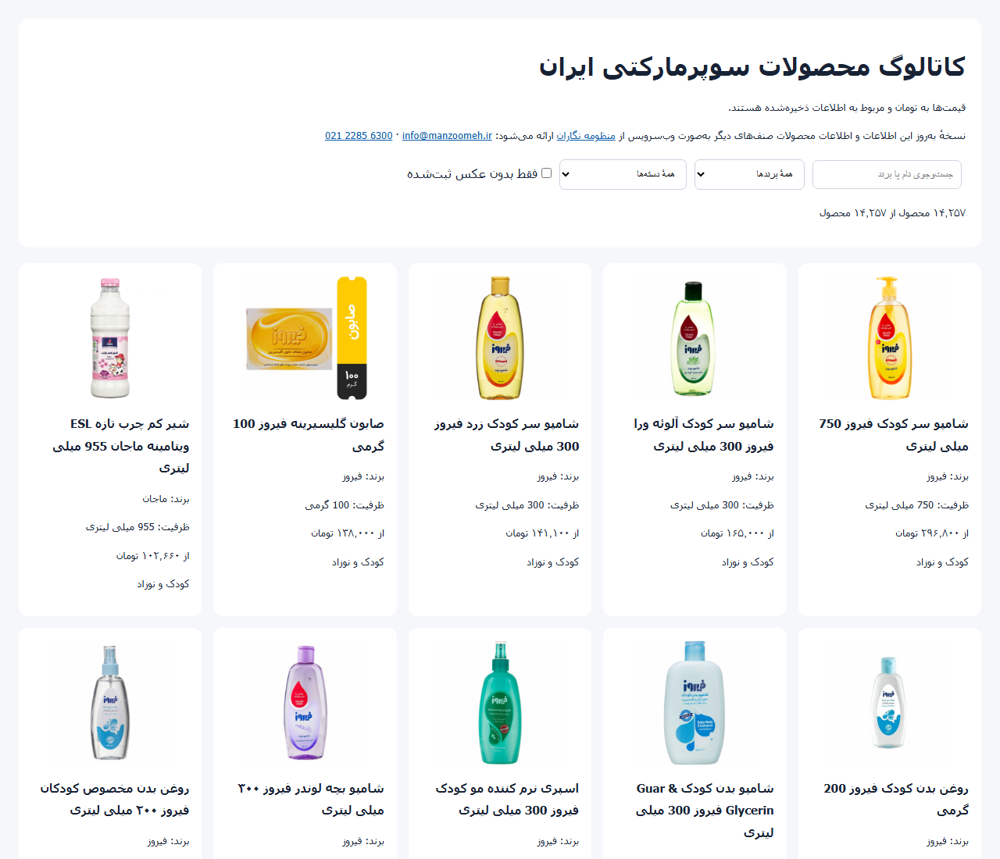

# Iran Supermarket Product Catalog · کاتالوگ محصولات سوپرمارکتی ایران

[](#dataset-at-a-glance)
[](https://github.com/Manzoomeh/iran-supermarket-catalog/releases/tag/v1.0.0)
[](#dataset-at-a-glance)
[](#categories)
[](#quick-start)
[](https://github.com/Manzoomeh/iran-supermarket-catalog/releases/latest)

**14,257 Iranian supermarket products** — name, brand, size, category, reference price — with
**12,402 product photos**, packaged as a ready-to-query SQLite database and an offline HTML
catalog. Developers of online stores, grocery apps and retail software can start from real
product data instead of typing thousands of items by hand. Continuously updated data for this
and other trades is available online as a web service from
[Manzoomeh Negaran](https://manzoomeh.com).

<div dir="rtl" lang="fa">

**اطلاعات ۱۴٬۲۵۷ کالای سوپرمارکتی ایران** — نام، برند، وزن و حجم، دسته‌بندی و قیمت مرجع — همراه با
**۱۲٬۴۰۲ عکس محصول**، به‌صورت دیتابیس SQLite آمادهٔ استفاده و کاتالوگ HTML آفلاین. نسخهٔ به‌روز این
اطلاعات و اطلاعات محصولات صنف‌های دیگر به‌صورت آنلاین و تضمینی از منظومه نگاران قابل دریافت است.

</div>

**[فارسی](#fa)** · **[English](#en)** ·
**[Download the images (image.zip)](https://github.com/Manzoomeh/iran-supermarket-catalog/releases/tag/v1.0.0)** ·
**[Contact · تماس](#contact)**



---

<a id="fa"></a>

<div dir="rtl" lang="fa">

## فارسی

### این مخزن چیست؟

اگر فروشگاه اینترنتی، اپلیکیشن سوپرمارکت، نرم‌افزار فروشگاهی یا هر پروژه‌ای دارید که به فهرست کالاهای
سوپرمارکتی نیاز دارد، لازم نیست هزاران کالا را یکی‌یکی وارد کنید. این مخزن یک برش آماده از اطلاعات
کالاهای سوپرمارکتی ایران است: نام کامل کالا، برند، وزن یا حجم، تعداد در بسته، دسته‌بندی، قیمت مرجع به
تومان و عکس محصول.

شرکت **منظومه نگاران** سال‌هاست اطلاعات محصولات را جمع‌آوری و نگهداری می‌کند و آن را به‌صورت
**وب‌سرویس** ارائه می‌دهد. این مخزن یک نمونهٔ عمومی از همان اطلاعات است؛ اگر برای پروژهٔ خود به اطلاعات
**به‌روز** محصولات این صنف یا صنف‌های دیگر نیاز دارید، می‌توانید آن را به‌صورت آنلاین و تضمینی از ما
دریافت کنید ([تماس](#contact)).

### مناسب برای

- راه‌اندازی سریع **فروشگاه اینترنتی** و سوپرمارکت آنلاین با کاتالوگ کامل کالا و عکس
- **اپلیکیشن‌های سفارش و ارسال** مواد غذایی و کالاهای مصرفی
- **نرم‌افزارهای فروشگاهی، حسابداری، انبارداری و صندوق** که به شناسنامهٔ کالا نیاز دارند
- مقایسهٔ قیمت، تحلیل بازار و بررسی سبد برندها
- نمونه‌سازی و پژوهش روی داده و عکس کالاهای مصرفی

### چه چیزی در آن هست؟

| مورد | مقدار |
|---|---|
| کالا | ۱۴٬۲۵۷ |
| برند | ۱٬۷۰۱ |
| دسته‌بندی | ۱۵ |
| فایل عکس محصول | ۱۲٬۴۰۲ (حدود ۱٫۷ گیگابایت) |
| کالای دارای عکس | ۱۲٬۵۹۱ |
| کالای دارای وزن یا حجم عددی | ۱۳٬۸۵۵ |
| کالای دارای قیمت مرجع | ۱۴٬۲۵۷ |
| تاریخ آماده‌سازی | ۱۰ مهر ۱۴۰۵ |

عکس‌ها به دلیل حجم، در خود مخزن نیستند و به‌صورت فایل **image.zip** در
[صفحهٔ نسخهٔ v1.0.0](https://github.com/Manzoomeh/iran-supermarket-catalog/releases/tag/v1.0.0)
منتشر شده‌اند.

### دسته‌بندی‌ها

| دسته | تعداد کالا |
|---|---|
| تنقلات | ۲٬۹۹۴ |
| نوشیدنی | ۲٬۲۱۰ |
| چاشنی و افزودنی | ۱٬۵۱۴ |
| دستمال و شوینده | ۱٬۳۹۸ |
| لبنیات و بستنی | ۱٬۲۸۸ |
| آرایشی و بهداشتی | ۱٬۰۲۰ |
| خانه و سبک زندگی | ۹۳۳ |
| کنسرو، غذای آماده و منجمد | ۸۲۱ |
| خشکبار، دسر و شیرینی | ۴۹۵ |
| صبحانه | ۴۹۰ |
| کودک و نوزاد | ۳۵۰ |
| دخانیات | ۲۶۳ |
| پروتیین و تخم مرغ | ۲۳۲ |
| لوازم برقی و دیجیتال | ۱۷۹ |
| میوه و سبزیجات تازه | ۷۰ |

### شروع سریع

۱. مخزن را دریافت کنید.

۲. فایل image.zip را از صفحهٔ نسخه دریافت کنید و کنار فایل catalog.html باز کنید تا پوشهٔ image کنار آن
قرار بگیرد.

۳. فایل catalog.html را در مرورگر باز کنید؛ جست‌وجو بر اساس نام و برند و فیلتر دسته‌بندی دارد و به
اینترنت نیازی ندارد. برای برنامه‌نویسی، فایل catalog.sqlite را با هر ابزار SQLite باز کنید.

</div>

```bash
git clone https://github.com/Manzoomeh/iran-supermarket-catalog.git
cd iran-supermarket-catalog
curl -LO https://github.com/Manzoomeh/iran-supermarket-catalog/releases/download/v1.0.0/image.zip
unzip image.zip
sha256sum -c --ignore-missing SHA256SUMS.txt
```

<div dir="rtl" lang="fa">

نمونهٔ پرس‌وجو و ساختار جدول‌ها در [بخش انگلیسی](#quick-start) آمده است.

### نکته‌های مهم دربارهٔ داده

- قیمت‌ها **قیمت مرجع** و مربوط به زمان جمع‌آوری (سپتامبر ۲۰۲۶، شهریور و مهر ۱۴۰۵) هستند و در این نسخه به‌روز
  نمی‌شوند. برای قیمت و موجودی به‌روز از وب‌سرویس استفاده کنید.
- برند از روی نام کالا و با یک واژه‌نامهٔ بازبینی‌شده استخراج شده است؛ ۱۶۹ کالا برند مشخص ندارند.
- ۶۹۲ رکورد برای بازبینی انسانی علامت خورده‌اند (ستون needs_review).
- ۱٬۶۶۶ کالا عکس ندارند.

### دریافت اطلاعات به‌روز به‌صورت وب‌سرویس

منظومه نگاران اطلاعات محصولات را به‌صورت مداوم به‌روز می‌کند و آن را به‌صورت وب‌سرویس آنلاین در
اختیار پروژه‌ها قرار می‌دهد. اگر به اطلاعات به‌روز کالاهای سوپرمارکتی، یا اطلاعات محصولات صنف دیگری
نیاز دارید، با ما تماس بگیرید.

### شرایط استفاده

برای محتوای دیتابیس، توضیحات کالا، نشان‌های تجاری و عکس‌ها مجوز دادهٔ باز یا استفادهٔ تجاری صادر
نشده است. نام کالاها، برندها و عکس محصولات متعلق به صاحبان آن‌هاست. جزئیات در فایل‌های
[DATA_LICENSE.md](DATA_LICENSE.md) و [NOTICE.md](NOTICE.md) آمده است. برای استفادهٔ تجاری و
پروژه‌های عملیاتی با ما تماس بگیرید.

</div>

---

<a id="en"></a>

## English

### What it is

A ready-made snapshot of Iranian supermarket product information: full product name, brand,
weight or volume, pack count, category, reference price in toman, and a product photo. Use it to
fill an online store, a grocery delivery app or retail software with a real catalog on day one.

**Manzoomeh Negaran** has been collecting and maintaining product information for years and
provides it as a web service. This repository is a public sample of that data. If your project
needs **up-to-date** product data for this trade or another one, you can receive it online, with a
service guarantee, from us — see [Contact](#contact).

### Who it is for

- Online supermarkets and e-commerce stores that need a complete product catalog with photos
- Grocery ordering and delivery apps
- Point-of-sale, accounting and inventory software that needs product master data
- Price comparison, market research and brand-portfolio analysis
- Prototyping and research on consumer-goods data and product images

### What's inside

| File | Contents |
|---|---|
| `catalog.sqlite` | The database: products, brands, categories and per-product source observations (24 MB) |
| `catalog.html` | Offline, searchable catalog for any browser: search by name or brand, filter by brand and category |
| `schema.sql` | Database schema |
| `dataset_manifest.json` | Counts and checksum of this package |
| `SHA256SUMS.txt` | SHA-256 checksums, including `image.zip` |
| `image.zip` (release asset) | 12,402 product photos in an `image/` folder, 1.71 GB — [download from release v1.0.0](https://github.com/Manzoomeh/iran-supermarket-catalog/releases/tag/v1.0.0) |
| `DATA_LICENSE.md`, `NOTICE.md` | Terms of use and source |

### Dataset at a glance

| Measure | Value |
|---|---|
| Products | 14,257 |
| Brands | 1,701 |
| Categories | 15 |
| Product image files | 12,402 (JPG 10,044 · PNG 2,282 · WEBP 61 · JPEG 15) |
| Products with an image | 12,591 |
| Products with a numeric size | 13,855 |
| Products with a reference price | 14,257 |
| Products without a brand | 169 |
| Prepared | 2026-10-02, from data observed in September 2026 |

### Categories

| Category | Products |
|---|---|
| Snacks — تنقلات | 2,994 |
| Beverages — نوشیدنی | 2,210 |
| Condiments and additives — چاشنی و افزودنی | 1,514 |
| Tissues and detergents — دستمال و شوینده | 1,398 |
| Dairy and ice cream — لبنیات و بستنی | 1,288 |
| Cosmetics and personal care — آرایشی و بهداشتی | 1,020 |
| Home and lifestyle — خانه و سبک زندگی | 933 |
| Canned, ready-made and frozen food — کنسرو، غذای آماده و منجمد | 821 |
| Nuts, desserts and sweets — خشکبار، دسر و شیرینی | 495 |
| Breakfast — صبحانه | 490 |
| Baby and child — کودک و نوزاد | 350 |
| Tobacco — دخانیات | 263 |
| Protein and eggs — پروتیین و تخم مرغ | 232 |
| Electrical and digital — لوازم برقی و دیجیتال | 179 |
| Fresh fruit and vegetables — میوه و سبزیجات تازه | 70 |

### Quick start

```bash
git clone https://github.com/Manzoomeh/iran-supermarket-catalog.git
cd iran-supermarket-catalog

# Product photos: 12,402 files, 1.71 GB
curl -LO https://github.com/Manzoomeh/iran-supermarket-catalog/releases/download/v1.0.0/image.zip
unzip image.zip          # creates image/ beside catalog.html

# Verify the download
sha256sum -c --ignore-missing SHA256SUMS.txt
```

Open `catalog.html` in a browser, or query the database. `image_path` is relative to the folder
that holds `catalog.sqlite`, so `image/img_000001.jpg` resolves once `image.zip` is extracted.

```sql
-- Dairy products with brand, size, reference price and photo
SELECT full_name, brand, capacity_text, price_toman, image_path
FROM product_catalog
WHERE category = 'لبنیات و بستنی'
LIMIT 10;

-- Brands with the most products
SELECT brand, COUNT(*) AS products
FROM product_catalog
WHERE brand IS NOT NULL
GROUP BY brand
ORDER BY products DESC
LIMIT 20;
```

```python
import sqlite3

con = sqlite3.connect("catalog.sqlite")
rows = con.execute(
    "SELECT full_name, brand, capacity_value, capacity_unit, image_path "
    "FROM product_catalog WHERE brand = ? LIMIT 5",
    ("کاله",),
)
for row in rows:
    print(row)
```

### Data model

The `product_catalog` view joins each product to its brand and category. Main columns of
`products`:

| Column | Meaning |
|---|---|
| `full_name` | Product name as listed, in Persian |
| `brand_id` → `brands.name` | Brand, extracted from the product name with a reviewed vocabulary |
| `capacity_text` | Size as written, e.g. 750 میلی لیتری |
| `capacity_value`, `capacity_unit` | Parsed size: `g`, `kg`, `ml`, `l`, `piece`, `pack`, `sheet`, `m` and others |
| `pack_count` | Items per pack, when stated |
| `price_toman`, `price_type` | Reference price in toman; every price is a "starting from" price |
| `image_path`, `image_present` | Relative path of the photo inside `image.zip` |
| `image_kind` | `product`, or `placeholder` when the source showed no real photo |
| `needs_review`, `review_notes` | Records flagged for human review (692) |
| `source_product_id` | Identifier of the product in the source listing |

`observations` keeps the original source record for every product, and `source_files` lists the
pages each record came from. See [`schema.sql`](schema.sql) for the full schema.

### Data notes and limits

- Prices are reference prices from September 2026 and are not refreshed in this package. Use the
  web service for current prices.
- Brands come from product names, not from a structured field; spelling variants were normalized
  only by exact text.
- 1,666 products have no photo; 692 records are flagged for review.
- The dataset holds no barcodes (GTIN/EAN).

### Up-to-date data as a web service

Manzoomeh Negaran keeps product information current and delivers it to projects as an online web
service. If you need maintained supermarket product data, or product data for another trade,
[contact us](#contact).

### Terms of use

No open-data or commercial-use license is granted for the database contents, product
descriptions, trademarks or images. Product names, brand names and product photos remain with
their owners. Read [DATA_LICENSE.md](DATA_LICENSE.md) and [NOTICE.md](NOTICE.md) before reuse,
and contact us for commercial and production use.

---

<a id="contact"></a>

## Contact · تماس با ما

**Manzoomeh Negaran** — [manzoomeh.com](https://manzoomeh.com) · [manzoomeh.ir](https://www.manzoomeh.ir) · initiative [schema.ir](https://schema.ir)

| | |
|---|---|
| Email | [info@manzoomeh.ir](mailto:info@manzoomeh.ir?subject=Supermarket%20product%20data%20web%20service) |
| Phone | [+98 21 2285 6300](tel:+982122856300) |
| Address | Unit 25, 7th floor, No. 193, Beheshti Street, Tehran, Iran |
| Hours | Saturday–Wednesday 09:00–17:30 · Thursday 09:00–13:00 (Tehran time) |
| Questions about this dataset | [Open an issue](https://github.com/Manzoomeh/iran-supermarket-catalog/issues) |

<div dir="rtl" lang="fa">

**منظومه نگاران** — برای دریافت اطلاعات به‌روز محصولات به‌صورت وب‌سرویس:
ایمیل info@manzoomeh.ir · تلفن ۰۲۱۲۲۸۵۶۳۰۰ · نشانی: تهران، خیابان شهید بهشتی، پلاک ۱۹۳، طبقهٔ ۷،
واحد ۲۵ · ساعت کاری: شنبه تا چهارشنبه ۹ تا ۱۷:۳۰، پنجشنبه ۹ تا ۱۳

</div>

---

## Keywords · کلیدواژه‌ها

<div dir="rtl" lang="fa">

دیتابیس محصولات سوپرمارکت · بانک اطلاعات کالا · دیتابیس کالاهای ایرانی · لیست کالاهای سوپرمارکتی ·
کاتالوگ کالا · عکس محصولات سوپرمارکت · بانک عکس کالا · دیتاست محصولات ایرانی · اطلاعات محصولات
فروشگاه اینترنتی · محتوای فروشگاه آنلاین · راه‌اندازی سوپرمارکت آنلاین · وب‌سرویس اطلاعات کالا ·
API اطلاعات محصولات · قیمت کالاهای سوپرمارکتی · لیست برندهای ایرانی · کالاهای تند مصرف ·
مواد غذایی · تنقلات · نوشیدنی · لبنیات · شوینده و بهداشتی · آرایشی و بهداشتی · کنسرو و غذای آماده ·
خشکبار و شیرینی · صبحانه · کالای کودک و نوزاد · نرم‌افزار سوپرمارکت · اپلیکیشن فروشگاه ·
نرم‌افزار حسابداری فروشگاهی · شناسنامهٔ کالا · منظومه نگاران

</div>

Iran supermarket product database · Iranian grocery dataset · Persian product catalog · Farsi
product names · supermarket product images · grocery product image dataset · FMCG product data
Iran · e-commerce product data · online store product catalog · product master data · Iranian
brands list · SQLite product dataset · product data web service · product information API ·
Manzoomeh Negaran · schema.ir
